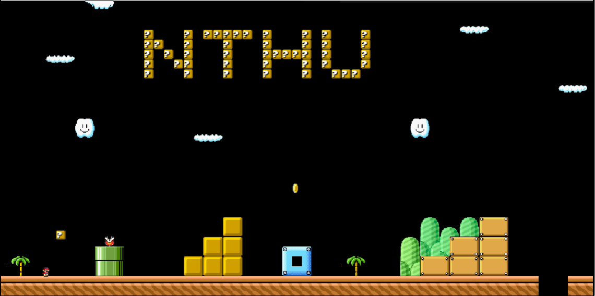
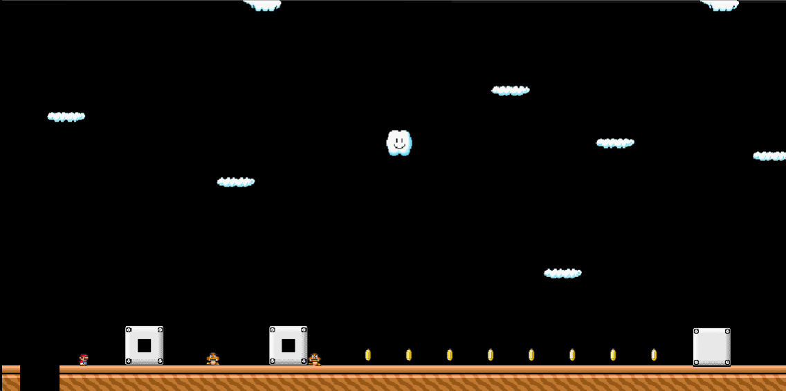
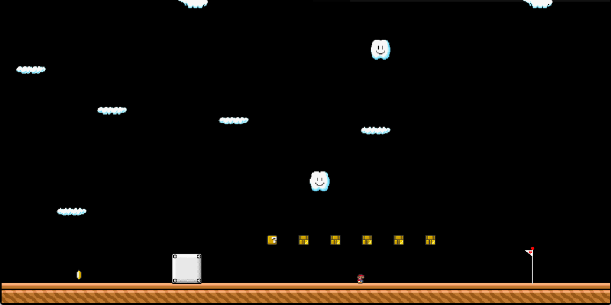
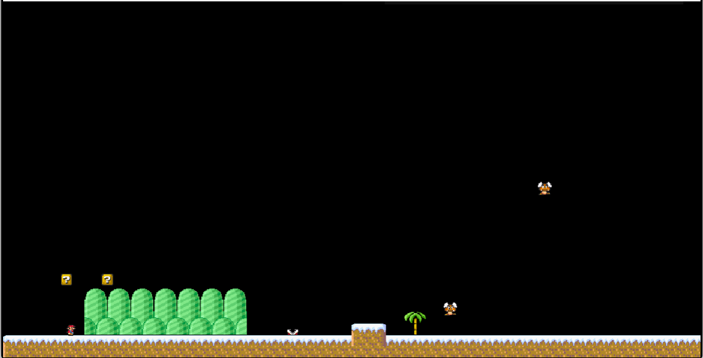
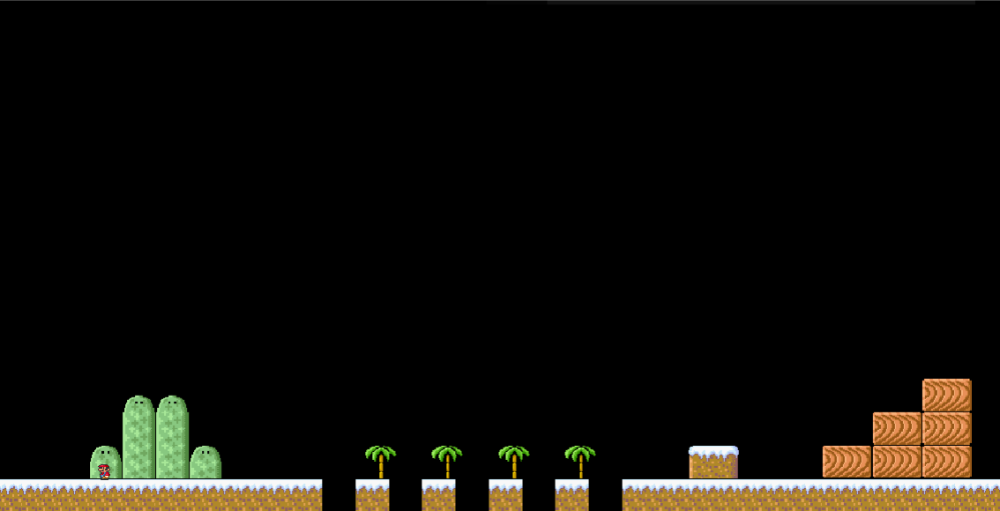
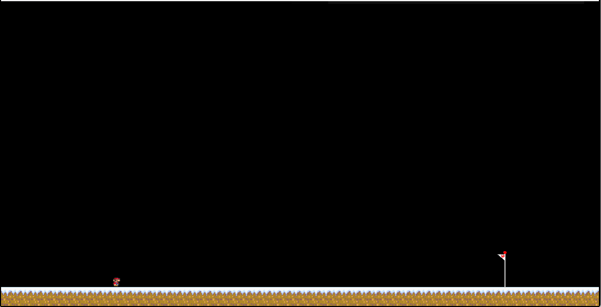
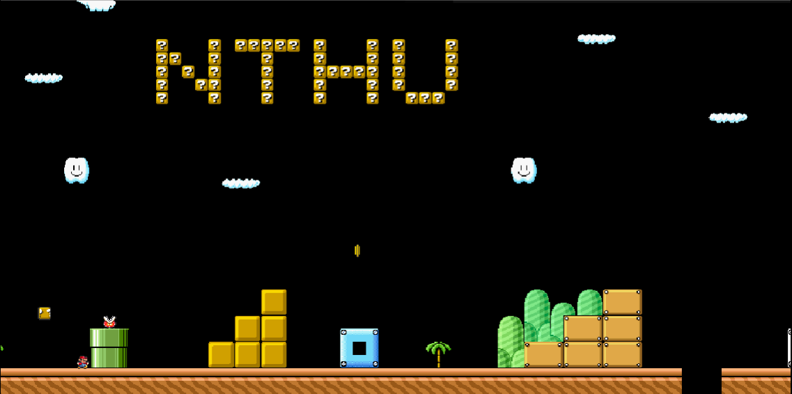
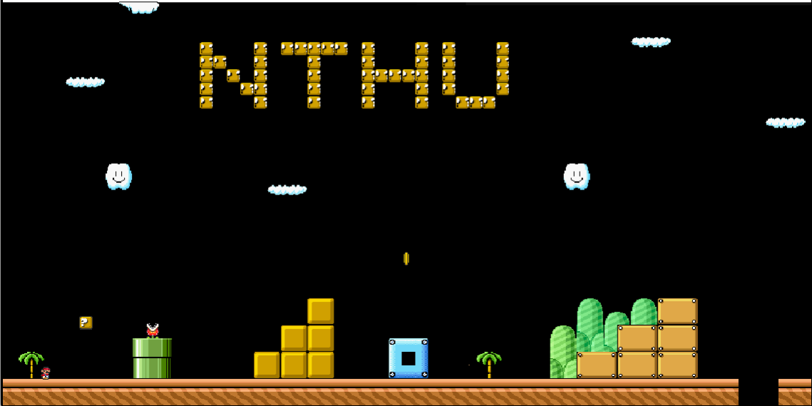
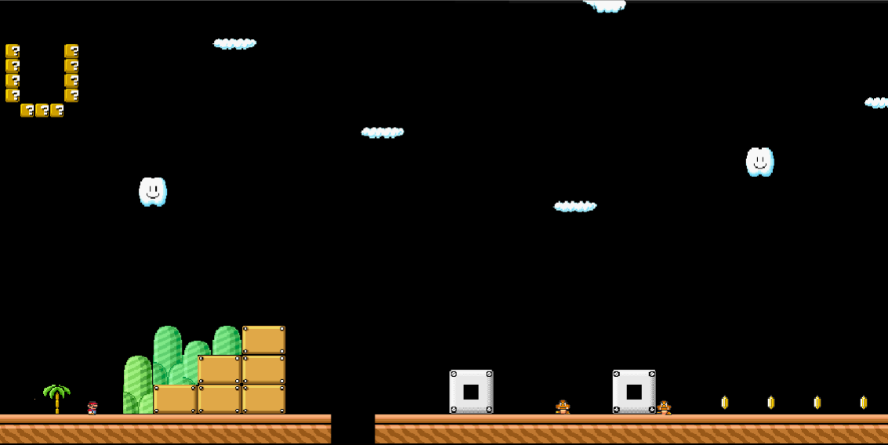
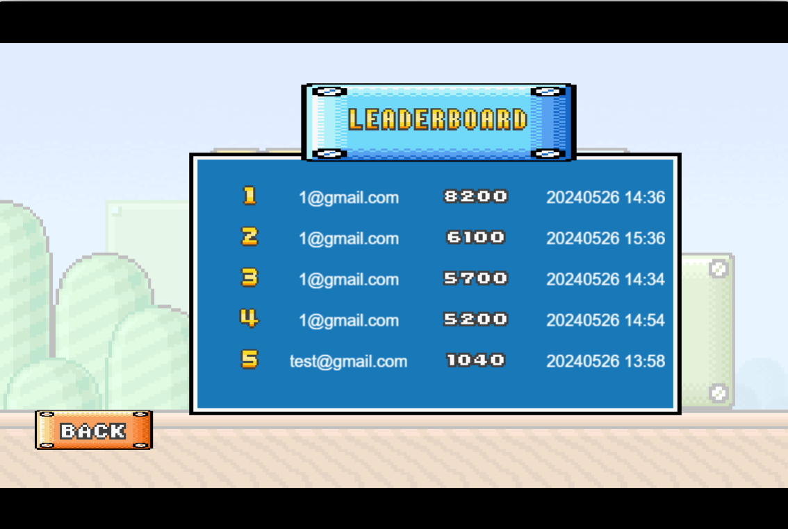

# Software Studio 2024 Spring Assignment 2

## Student ID : 111062107 Name : 鄧弘利

### Scoring

|**Basic Component**|**Score**|**Check**|
|:-:|:-:|:-:|
|Complete Game Process      |5%     |Y|
|Basic Rules                |55%    |Y|
|Animations                 |10%    |Y|
|Sound Effects              |10%    |Y|
|UI                         |10%    |Y|

|**Advanced Component**|**Score**|**Check**|
|:-:|:-:|:-:|
|firebase deploy            |5%     |Y|
|Leaderboard                |5%     |Y|
|Offline multi-player game  |5%     |N|
|Online multi-player game   |10%    |N|
|Others [name of functions] |1-10%  |N|

---

## Basic Components Description:

1. **World map:** 
   - **Description:** 我有兩張地圖，使用者必須要先通過第一關才可以進入第二關，在stage的時候才會有關卡2的按鈕。
     - 第一張地圖如下
     
     
     
     - 第二張地圖如下
     
     
     
   - **Features:**
     - 地圖中物品可受重力影響，包括玩家。且玩家在接觸到場景中物體時或是enemy會發生碰撞。下面這張圖顯示的就是當玩家跑的時候碰撞到物體，不會穿透。
     
     - 背景還有camera都會隨著玩家移動，而跟著移動。
     
     
     - 有兩種地圖

2. **Player**
    <!-- - **Description:**  -->
    - **Features:**
       - 按下left、right按鍵往左或右 space是跳。
       - 有三條命，碰到敵人不會回到原點重生，掉落地圖外才會重生在初始點。碰到敵人或是調出地圖外都會扣一滴血，且會進入一段無敵時間，在無敵時間玩家會閃爍，過無敵時間之後才會回到原本的樣子。
       - 不過當玩家吃下蘑菇後變大的狀態，碰到敵人時，不會扣血，而是進入無敵時間，並且恢復原本大小。
3. **Enemies**
    - **Description:**
       - 有三種敵人，Fly Goomba , Goomba , Flower。
       - Fly Goomba會進行飛行。
       - Goomba會在地面上進行移動。 有分成固定行徑還有追逐玩家兩種。
       - Flower會在地面上進行上下來回的移動。
    - **Features:**
       - 只有Goomba可以被玩家擊殺，只有當玩家跳下來的時候，採在Goomba的頭上時才會被擊殺。其他方向的碰撞並不會擊殺。

4. **Question Blocks**
    - **Description:**
       - 有兩種Question Blocks，一種是撞了只有加分數，另一種是撞了會生成蘑菇。
    - **Features:**
       - 當玩家由下往上跳，撞到會升成蘑菇的Question Blocks時，就會在Question Blocks的上方生成蘑菇。吃下蘑菇之後，玩家會變大。
       - 兩種撞了之後，都會變回普通的方塊。
5. **Animations**
    - **Description:**
       - Player has walk & jump animations
       - enemies animation 那三種Fly Goomba , Goomba , Flower都有各自的animation。
    <!-- - **Features:** -->
6. **Sound effects**
    - **Description:**
       - At least one BGM
       - Player Jump & die sound effects
       - 吃到金幣音效
       - 跳到enemy有kick音效
       - 蘑菇出現音效
       - 玩家powerup音效
       - 玩家powerdown音效
    <!-- - **Features:** -->
7. **UI**
    - **Description:**
       - Player life
       - Player score  
       - Timer
    <!-- - **Features:** -->

## Advanced Component Description:
<!-- Describe your advanced function and how to use it. -->
1. **firebase**
    <!-- - **Description:** -->
    - **Features:**
       - 可以提供Membership mechanism(Sign up, Login with firebase, save/restore game progress)
2. **Leaderboard**
    - **Description:**
       - 這裡會顯示歷史分數最高的五個紀錄，分別顯示紀錄者的email，分數，還有完成時間。
       
    <!-- - **Features:**  -->

# Firebase page link (if you deploy)

[https://mario-aa73c.web.app/](https://mario-aa73c.web.app/)

[https://mario-aa73c.firebaseapp.com/](https://mario-aa73c.firebaseapp.com/)